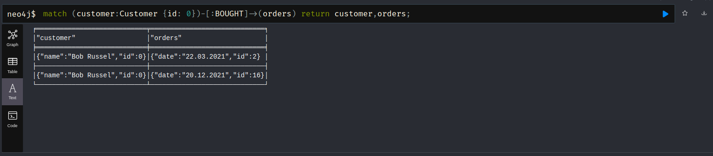

# Task 1 - Neo4j

## Creating the data.
To create the data run the script [**script.cypher**](./script.cypher).  
The final graph will look [this way](./img/graph-origin.png).

## Queries.

1. Show all the nodes with relationships.
  
    ```
    match (od:Order {id: 2})-[:CONTAINS]->(items) return od,items;
    ```
    
2. Count price of specific order.
  
    ```
    match (od:Order {id: 2})-[:CONTAINS]->(items) return sum(items.price);
    ```
    
3. Find all orders of specific customer.
  
    ```
    match (customer:Customer {id: 0})-[:BOUGHT]->(orders) return customer,orders;
    ```
    
4. Find all items bought by specific customer.
  
    ```
    match (customer:Customer {id: 0})-[:BOUGHT]->(orders)-[:CONTAINS]->(items) return customer,orders,items;
    ```
    
5. Find number of items bought by specific customer.
  
    ```
    match (customer:Customer {id: 0})-[:BOUGHT]->(orders)-[:CONTAINS]->(items) return customer,count(items);
    ```
    
6. Count the amount payed by specific customer.
  
    ```
    match (customer:Customer {id: 0})-[:BOUGHT]->(orders)-[:CONTAINS]->(items) return customer,sum(items.price);
    ```
    
7. Count how many times every item was bought. Sort by this value.
  
    ```
    match (it:Item)<-[:CONTAINS]-(orders) return it,count(orders) as num order by num desc;
    ```
    
8. Show all items viewed by specific customer.
  
    ```
    match (customer:Customer {id: 0})-[:VIEW]->(items) return customer,items;
    ```
    
9. Show all other items that were bought together with specific item.
  
    ```
    match (it:Item {id:1})<-[:CONTAINS]-(orders)-[:CONTAINS]->(items) return DISTINCT it, items;
    ```
    
10. Find all customer that bought specific item.
  
    ```
    match (it:Item {id:0})<-[:CONTAINS]-(orders)<-[:BOUGHT]-(customers) return it,customers;
    ```
    
11. Find for specific customer items he viewed, but has not bought.
  
    ```
    match (customer:Customer {id:0})-[:VIEW]->(itemsViewed)
    where not (customer)-[:BOUGHT]->()-[:CONTAINS]->(itemsViewed)
    return itemsViewed;
    ```
    
