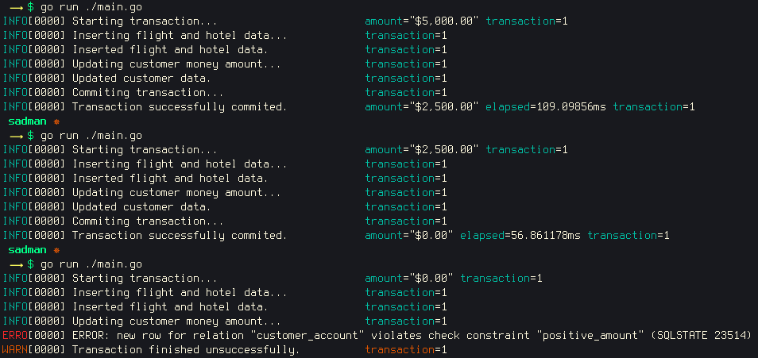
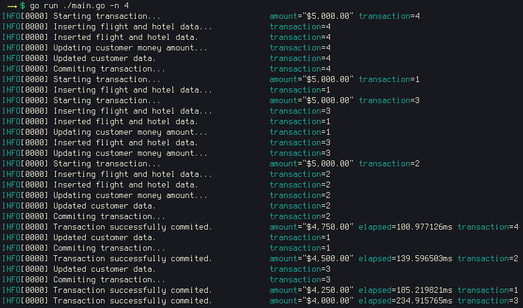
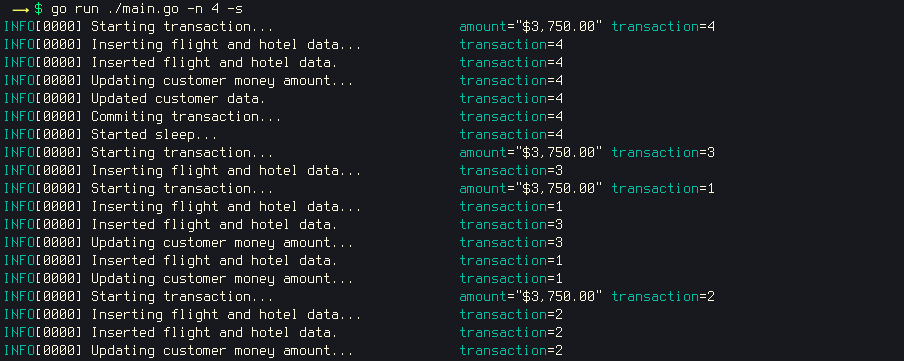
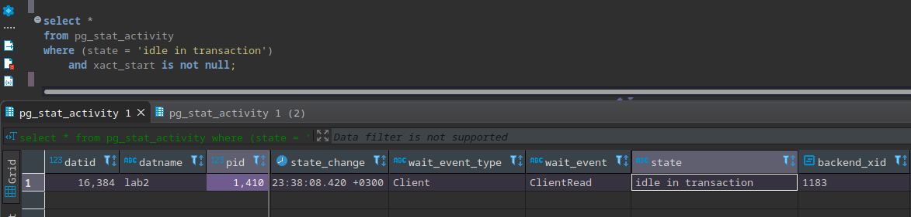
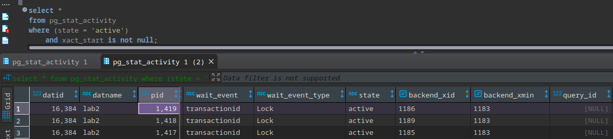
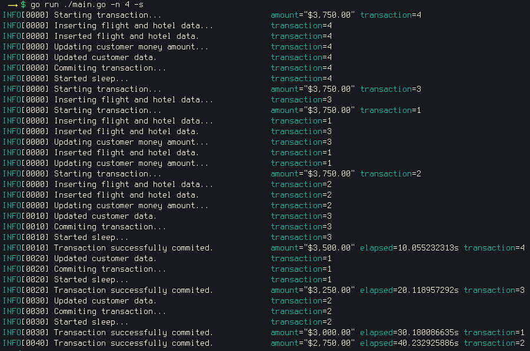

# Task 2 - 2PC

## Initializing the database.
To populate the database use the script [**task_2pc.sql**](./task_2pc.sql).  
This script will create 3 schemas(*account*, *flight* and *hotel*) with one table in each respectively(*customer_account*, *flight_booking* and *hotel_booking*).  

## Console script.
Console script is a golang program written using [**pgx library**](https://pkg.go.dev/github.com/jackc/pgx/v4).  
To run script use this command: `go run ./main.go`. Without any flags it will add dummy records to *flight_booking* and *hotel_booking* tables and recount **amount** field in *customer_account* table for specific customer(in our case it is customer with customer_id=2). If *price* value is greater that customer's current *amount* then transaction will be failed:  
  
  
Let's run a few transactions at once. To do so, we need to leverage flag **-n**:  
  
  
To simulate transaction block, will be used **sleep** for 10 seconds (pgx library doesn't provide any method to *prepare transaction*). Running the command: `go run ./main.go -n 4 -s`:  


Transaction №4 is in the sleep before commit:  
```sql
select * 
from pg_stat_activity
where (state = 'idle in transaction')
    and xact_start is not null;
```  
  

And other transactions are waiting before they will be able to work with the same row from *customer_account* table:  
```sql
select * 
from pg_stat_activity
where (state = 'active')
    and xact_start is not null;
```  
  
  
One by one transactions are finished and the final log looks this way:  

